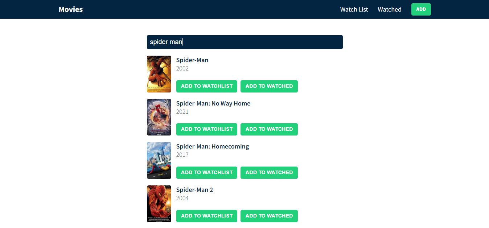

# Movies application live :

https://65479a1f30cd2a4bf9448acd--comforting-crepe-e00783.netlify.app/

# Used Tools:

1-Html5  
2-Css3  
3-Media Query For Responsive Design  
4-Javascript 
5-Font Awesome Icons  
8-React.js  
9-Context API  
10-React Hooks [useState,useContext,useReducer,useEffect]  
11-Fetch Data (axios)  
12-Local Storage  
13-post man to handle the api

## Api Link :

https://www.omdbapi.com/?i=tt3896198&apikey=7c19149b

# Main Features Of App

1-app contains 3 different pages  
2-this app is single page application (SPA) where there is no relod and refresh to the browser in page  
3-Watchlist page (Home Page) 
4-Watched page .  
5-Add Page. 
6-In the Add Page user can search about the movie by click input then the app will render the available movies to the user. 
7-User can add the movie to the watchlist page or watched page. 
8-if the user add the movie to the watchlist page , he can go to the watchlist page and see the all add movies then if he wanted to remove it click delete icons . 
9-if the user add the movie to the watchlist page , he can go to the watchlist page and see the all add movies then if he wanted to add it to watched page click eye icon . 
10-if the user add the movie to the watched page , he can go to the watched page and see the all add movies then if he wanted to remove it click delete icons . 
11-if the user add the movie to the watched page , he can go to the watched page and see the all add movies then if he wanted to add it to watchlist page click eye-slash icon . 
12-there is local storage in the app to all movies in different pages where the user close the website or reload the page , it don't remove any thing. 
